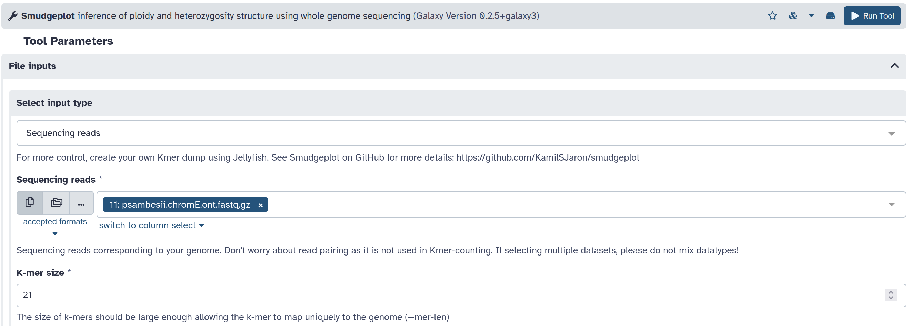

# Analysis of DNA sequencing

In this first step, we will analyze the quality and length of PacBio HiFi and Nanopore R10.4 sequencing data prior to assembly. PacBio HiFi and Nanopore R10.4 reads are both high-accuracy datasets. We will extract the *k*-mers from these reads to estimate features of the genome (size, heterozygosity, repetitive content, ploidy). The two datasets used in the tutorial are subsets of sequencing data for the nematode *Plectus sambesii*, selected for both haplotypes of chromosome E (project [PRJEB74285](https://www.ebi.ac.uk/ena/browser/view/PRJEB74285)). PacBio HiFi reads were generated at the [Genomics and Transcriptomics Lab](https://www.gtl.hhu.de/) from an ultra-low input library prepared with polymerases A and B and sequenced on a Sequel apparatus. Nanopore reads were generated at the Universität zu Köln with the LSK114 kit and sequenced on a MinION sequencer. More information about these reads can be found in:

```
Guiglielmoni, N., & Schiffer, P. H. (2024). Phasing or purging: tackling the genome assembly of a highly heterozygous animal species in the era of high-accuracy long reads. bioRxiv, 2024-06.
```

Goals:
* assess the quality and length of long-read datasets
* estimate genome characteristics using *k*-mer approaches

## Formats

Reads are provided in FASTQ format. This format includes four lines per read: 1) the sequence name preceeded by \@, 2) the nucleotide sequence, 3) line separator, 4) the quality score. Here is an example of a PacBio HiFi reads in FASTQ format:

```
@m54274Ue_211113_113851/61670066/ccs
CTATACATAG
+
dO`XTamuoP
```

In FASTA format, there is only the read name preceeded by \> and the nucleotide sequence (no quality score).

```
>m54274Ue_211113_113851/61670066/ccs
CTATACATAG
```

## Nanoplot 

The tool NanoPlot takes as input a read file as FASTQ, FASTA, or BAM (compressed or not). Quality metrics cannot be computed with a fasta file, as it does not contain quality values (only nucleotides). Plots generated by NanoPlot can show length distribution and quality distribution. PacBio HiFi reads generally have a length around 10-15 kb, and a quality over 20 and reaching much higher values. Nanopore R10.4 reads are not limited in size; depending on the quality of the extraction, they can range from 10 kb to 100+ kb (even 1+ Mb). Their accuracy has improved over Nanopore R9.4.1 reads, but is lower than PacBio HiFi reads (from 5 to 40). The quality score is on a negative log10 scale: Q20 means 99\% accuracy, Q30 means 99.9\% accuracy.

## NanoPlot on PacBio HiFi reads

[NanoPlot](https://github.com/wdecoster/NanoPlot)


```sh
NanoPlot --tsv_stats --fastq psambesii.chromE.hifi.fastq.gz
```


These PacBio HiFi reads have a length mostly ranging from 10 to 20 kilobases (kb). This length is limited due to the polymerases used for PacBio sequencing. The quality score goes from 20 to 90, indicating a high accuracy with all reads over 99\% accuracy.

## NanoPlot on Nanopore reads

[NanoPlot](https://github.com/wdecoster/NanoPlot)


```sh
NanoPlot --tsv_stats --fastq psambesii.chromE.hifi.fastq.gz
```


These Nanopore R10.4 reads have a length reaching 100 kb, and some even longer reads. This is because the pore technology does not limit read length, unlike polymerases used for PacBio sequencing. The quality score ranges from 5 to 35. Although the quality of these reads is not as high as PacBio HiFi reads, there are enough high-accuracy reads over Q20 (99\% accuracy) to produce a highly accurate consensus. Therefore, Illumina reads are not mandatory for polishing a Nanopore R10.4 assembly, as was the case for Nanopore R9.4.1 reads.

PacBio HiFi reads have the advantage in terms of accuracy, and Nanopore R10.4 reads have the advantage for length. Advantages from both datasets can be leveraged to produce asssemblies with high accuracy and contiguity. 

## GenomeScope on PacBio HiFi reads

[jellyfish](https://github.com/gmarcais/Jellyfish)
[GenomeScope2](https://github.com/tbenavi1/genomescope2.0)

To learn more [about GenomeScope](https://www.youtube.com/watch?v=s808LzwI-u4).

```
Ranallo-Benavidez, T. R., Jaron, K. S., & Schatz, M. C. (2020). GenomeScope 2.0 and Smudgeplot for reference-free profiling of polyploid genomes. Nature Communications, 11(1), 1432.
```

Sequencing reads are provided as input to `jellyfish count` to build a database of *k*-mers, with *k* set to 21 in this case. Multiple odd values can be tested for *k*, such as 23, 25, 27, 29, 31... Lower values are prefered for low-coverage datasets. A histogram is built from the *k*-mer database using `jellyfish hist`. GenomeScope2 is then run to visualize the histogram and compute estimations of genome size, heterozygosity, repeat content. 

 

 

 

```sh
jellyfish count --mer-len 21 psambesii.chromE.hifi.fastq.gz
jellyfish histo -o jellyfish.histo mer_counts.jf
genomescope2 --input jellyfish.histo --output . --kmer_length 21
```


Two peaks can be distinguished (expected for a diploid species), the first one being heterozygous *k*-mers and the second one homozygous *k*-mers. The two peaks are not well separated because the ultra-low input library was amplified. The genome size is estimated at 17 Megabases (Mb), which is the size calculated for one haplotype. Thus for both haplotypes (as *Plectus sambesii* is diploid) we would expect about 34 Mb. The ab content (*k*-mers different between the two haplotypes) is estimated to 3.69\%, indicating a high heterozygosity. The unique content is estimated as 92.8\%, i.e. there is a low repeat content at 7.2\%. 

## GenomeScope on Nanopore R10.4 reads

[jellyfish](https://github.com/gmarcais/Jellyfish)
[GenomeScope2](https://github.com/tbenavi1/genomescope2.0)

 

 

 

```sh
jellyfish count --mer-len 21 psambesii.chromE.ont.fastq.gz
jellyfish histo -o jellyfish.histo mer_counts.jf
genomescope2 --input jellyfish.histo --output . --kmer_length 21
```


There are again two peaks, well separated as this library was not amplified. The genome size is estimated as 18 Mb with a heterozygosity (ab content) of 3.47\%. The unique content is estimated as 93\% (7% repeat content). 

## Smudgeplot on Nanopore R10.4 reads

[Smudgeplot](https://github.com/KamilSJaron/smudgeplot)

To learn more [about Smudgeplot](https://www.youtube.com/watch?v=3erlEY8HKDs).

```
Ranallo-Benavidez, T. R., Jaron, K. S., & Schatz, M. C. (2020). GenomeScope 2.0 and Smudgeplot for reference-free profiling of polyploid genomes. Nature Communications, 11(1), 1432.
```



```sh
mkdir tmp_smudge
ls ju765.hifi_reads.decont.3Gb.fastq.gz > FILES
kmc -k21 -ci1 -cs10000 @FILES kmcdb tmp_smudge
kmc_tools transform kmcdb histogram kmcdb_k21.hist -cx10000

L=$(smudgeplot.py cutoff kmcdb_k21.hist L)
U=$(smudgeplot.py cutoff kmcdb_k21.hist U)
echo $L $U

kmc_tools transform kmcdb -ci"$L" -cx"$U" dump -s kmcdb_L"$L"_U"$U".dump
smudgeplot.py hetkmers -o kmcdb_L"$L"_U"$U" < kmcdb_L"$L"_U"$U".dump

smudgeplot.py plot kmcdb_L"$L"_U"$U"_coverages.tsv
```


The strong signal around 1/2 2N supports a prediction of a diploid genome.

## Smudgeplot on PacBio HiFi reads


