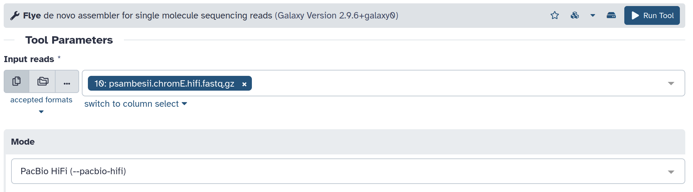
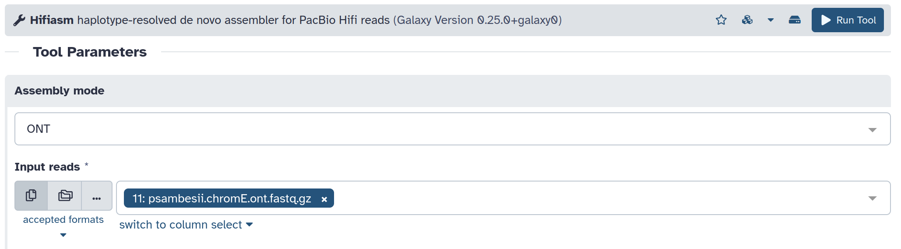
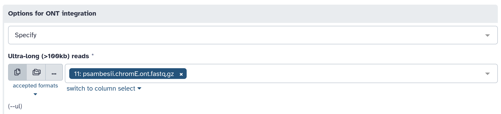
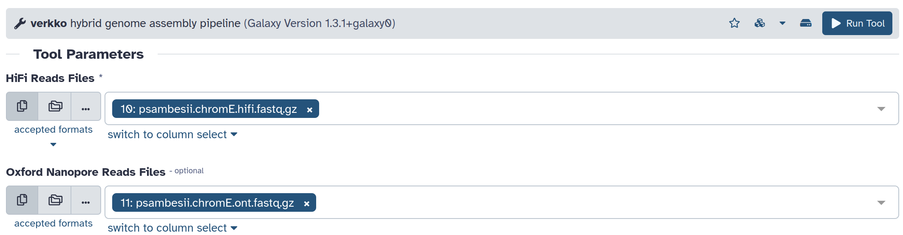
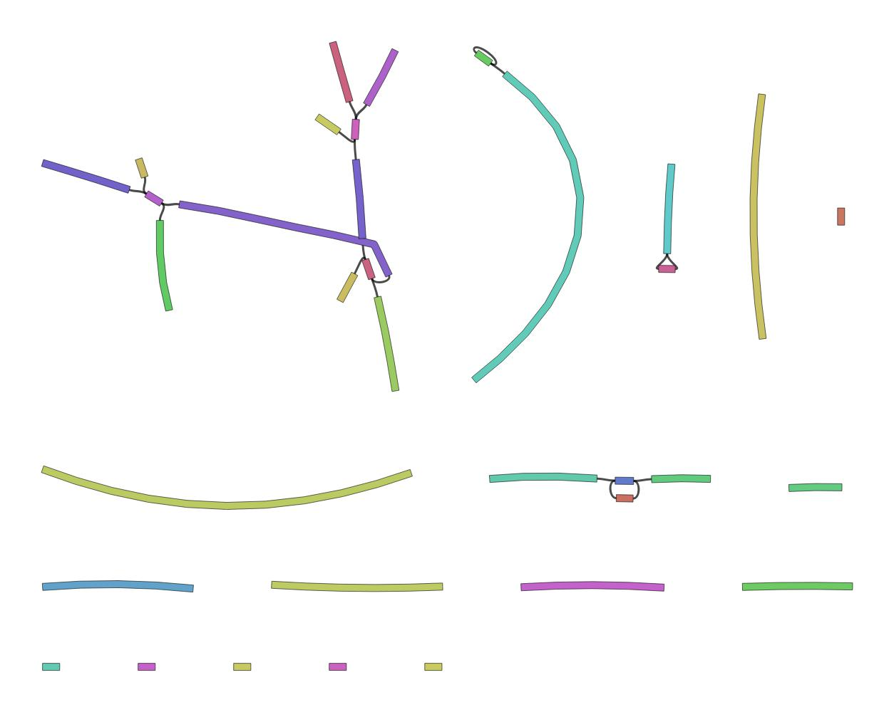

# *De novo* assembly

In this section, we will produce a draft assembly for chromosome E of the nematode *Plectus sambesii* using PacBio HiFi and Nanopore R10.4 long reads. As the datasets were generated for a clonal population (as if they were from a single individual), we will attempt to generate a phased assembly, with both haplotypes represented. This is only possible with datasets from one individual or a clonal population. When using datasets from multiple individuals, the assembly can be collapsed, i.e. all pairs (or sets) of chromosomes are represented with a single sequence. 
In Section 1, the genome size (or rather chromosome size) for one haplotype was estimated to 17-18 Mb, thus we expect a phased assembly of 34-36 Mb. The two datasets used in the tutorial are subsets of sequencing data for the nematode *Plectus sambesii*, selected for both haplotypes of chromosome E (project [PRJEB74285](https://www.ebi.ac.uk/ena/browser/view/PRJEB74285)). PacBio HiFi reads were generated at the [Genomics and Transcriptomics Lab](https://www.gtl.hhu.de/) from an ultra-low input library prepared with polymerases A and B and sequenced on a Sequel apparatus. Nanopore reads were generated at the Universität zu Köln with the LSK114 kit and sequenced on a MinION sequencer. More information about these reads can be found in:

```
Guiglielmoni, N., & Schiffer, P. H. (2024). Phasing or purging: tackling the genome assembly of a highly heterozygous animal species in the era of high-accuracy long reads. bioRxiv, 2024-06.
```

Goals:
* generate draft phased assemblies using PacBio HiFi and Nanopore reads, separately and combined
* investigate the assembly graph

Content:
* [hifiasm PacBio HiFi](#hifiasm-PacBio-HiFi)
* [Flye PacBio HiFi](#Flye-PacBio-HiFi)
* [hifiasm Nanopore](#hifiasm-Nanopore)
* [Flye Nanopore](#Flye-Nanopore)
* [hifiasm PacBio HiFi and Nanopore](#hifiasm-PacBio-HiFi-and-Nanopore)
* [Verkko PacBio HiFi and Nanopore](#Verkko-PacBio-HiFi-and-Nanopore)
* [Checking the Graphical Fragment Assembly](#Checking-the-Graphical-Fragment-Assembly)

## hifiasm PacBio HiFi

To learn more [about hifiasm](https://www.youtube.com/watch?v=RtTRC3AaaPk&t=1927s).

[hifiasm](https://github.com/chhylp123/hifiasm)

```
Cheng, H., Concepcion, G. T., Feng, X., Zhang, H., & Li, H. (2021). Haplotype-resolved de novo assembly using phased assembly graphs with hifiasm. Nature Methods, 18(2), 170-175.
```


```sh
hifiasm -o assembly -f 37 -l 0 -s 0.75 -O 1 --primary psambesii.chromE.hifi.fastq.gz
```

The parameter `-l 0` is used (by default in Galaxy) to set the purging level to 0, as we do not want to purge any haplotigs at all to obtain a phased draft assembly. In the case that you do not want to phase your assembly but rather have a collapsed assembly (dataset from multiple individuals), the purging level can be set up to `-l 3` (for aggressive purging). It should be noted that this purging may not be sufficient to remove all haplotigs (especially when working with high-heterozygosity genomes) and that more haplotig purging may be necessary (see Section 3). 

## Flye PacBio HiFi

[Flye](https://github.com/fenderglass/Flye)

```
Kolmogorov, M., Yuan, J., Lin, Y., & Pevzner, P. A. (2019). Assembly of long, error-prone reads using repeat graphs. Nature Biotechnology, 37(5), 540-546.
```



```sh
flye --pacbio-hifi psambesii.chromE.hifi.fastq.gz -o out_dir -i 1
```

In this example, Flye is run with default parameters. For genomes over 2\% heterozygosity, Flye will generally retain all haplotypes and yield a phased assembly, without even adding the parameter `--keep-haplotypes`. For lower heterozygosity genomes, haplotypes tend to be collapsed and then I guess that the parameter `--keep-haplotypes` would be necessary for a phased assembly. 
  
## hifiasm Nanopore

[hifiasm](https://github.com/chhylp123/hifiasm)

From hifiasm v0.20, the parameter `--ont` was introduced to assemble Nanopore R10.4 reads *de novo*, with no PacBio HiFi reads.



```sh
 hifiasm --ont -o output -f 37 -l 0 --primary psambesii.chromE.ont.fastq.gz
```

## Flye Nanopore

[Flye](https://github.com/fenderglass/Flye)


```sh
flye --nano-corr psambesii.chromE.hifi.fastq.gz -o out_dir -i 1
```

## hifiasm PacBio HiFi and Nanopore

It is possible to combine PacBio HiFi reads and Nanopore reads with hifiasm. The PacBio HiFi reads are used to build the graph and Nanopore reads to resolve difficult paths. The Nanopore reads are passed with the parameter `--ul` in this case. The manual suggests ultra-long reads over 100 kb, but Nanopore datasets much shorter than that are still useful. We can't all have 100+ kb Nanopore datasets. 

[hifiasm](https://github.com/chhylp123/hifiasm)




```sh
hifiasm -o output -f 37 -l 0 --ul psambesii.chromE.ont.fastq.gz --ul-rate 0.2 --ul-tip 6  --primary psambesii.chromE.hifi.fastq.gz
```

hifiasm only outputs assemblies in GFA formats, but many tools need a fasta as input. GFAs can easily be converted into FASTA files with the module "Convert GFA to FASTA" in Galaxy or an awk command line in the terminal.


```sh
awk '/^S/{print ">"$2;print $3}' assembly.gfa > assembly.fasta
```

## Verkko PacBio HiFi and Nanopore

Verkko is annother assembler that can combine PacBio HiFi and Nanopore reads. It can also be used with PacBio HiFi reads only.

[Verkko](https://github.com/marbl/verkko)

 

```sh
verkko --hifi psambesii.chromE.hifi.fastq.gz --nano psambesii.chromE.ont.fastq.gz -d asm 
```

## Checking the Graphical Fragment Assembly 

hifiasm, Flye and Verkko produce Graphical Fragment Assemblies (GFA), which include the nucleotide sequences and potential links connecting them. This assembly graph can be visualized to examine unresolved paths (where the assembler had multiple paths to connect sequences and could not choose a single one). We will use the tool Bandage to look at the assembly graphs.

NB: Flye has two files called "assembly graph" and "graphical fragment assembly". The first one is a different format. We want the "graphical fragment assembly".

To learn more [about Bandage](https://www.youtube.com/watch?v=cierloa5hS0).

[Bandage](https://rrwick.github.io/Bandage/)

```
Wick, R. R., Schultz, M. B., Zobel, J., & Holt, K. E. (2015). Bandage: interactive visualization of de novo genome assemblies. Bioinformatics, 31(20), 3350-3352.
```

### Bandage info


```sh
Bandage info input.gfa 
```
```
Node count: 	34
Edge count: 	20
Smallest edge overlap (bp): 	0
Largest edge overlap (bp): 	0
Total length (bp): 	35797610
Total length no overlaps (bp): 	35797610
Dead ends: 	38
Percentage dead ends: 	55.8824%
Connected components: 	17
Largest component (bp): 	10696046
Total length orphaned nodes (bp): 	16754063
N50 (bp): 	2231814
Shortest node (bp): 	699
Lower quartile node (bp): 	44143
Median node (bp): 	679885
Upper quartile node (bp): 	1429673
Longest node (bp): 	5107803
Median depth: 	0
Estimated sequence length (bp): 	0
```

The nodes are the nucleotide sequences and the edges are the connections between the sequences based on overlaps. The assembly size is 35,797,610, matching the expected size based on twice the estimated GenomeScope size (with the two haplotypes). 

### Bandage image


```sh
Bandage image input.gfa 
```


