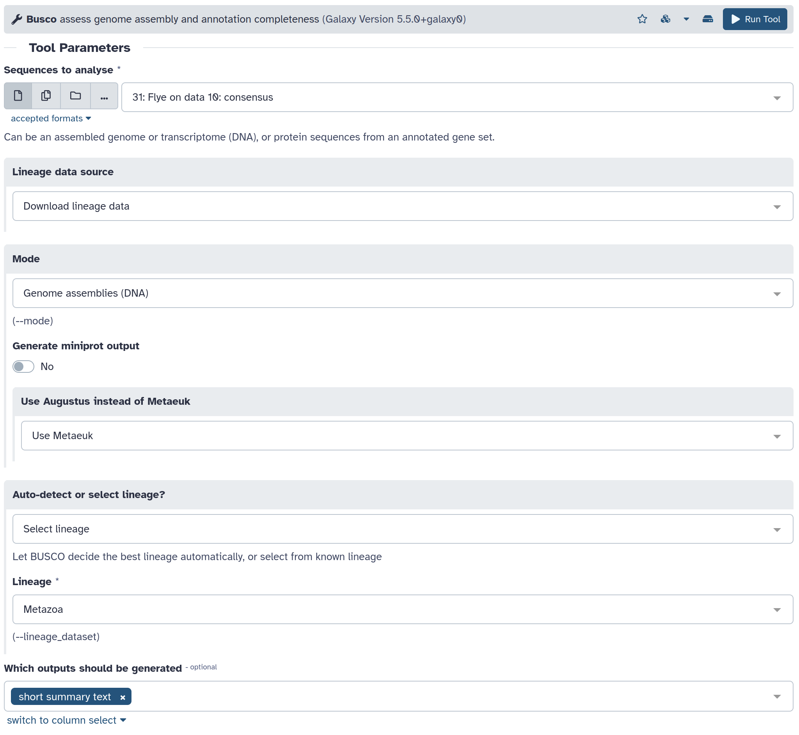
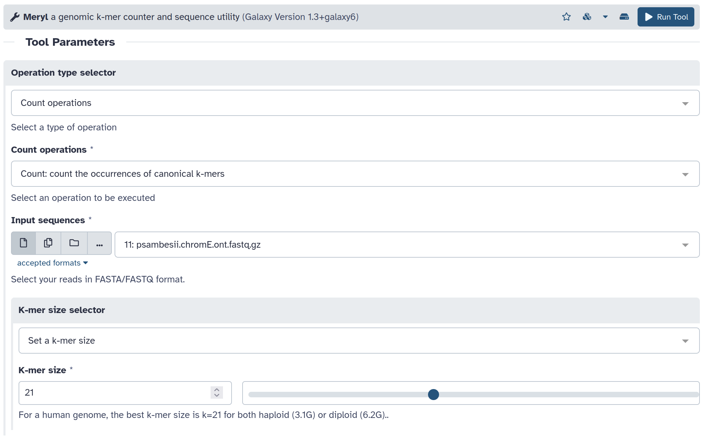
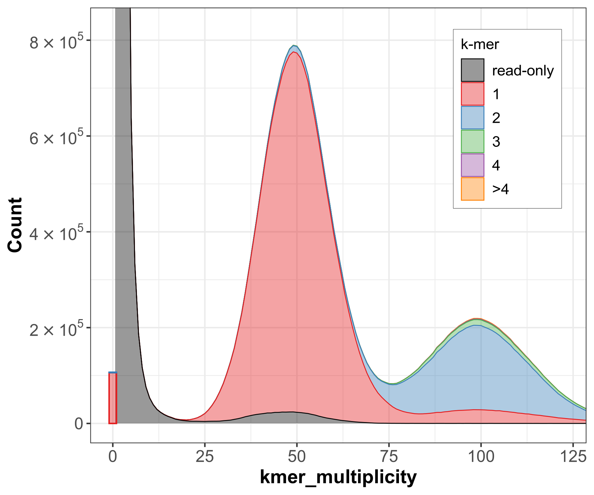
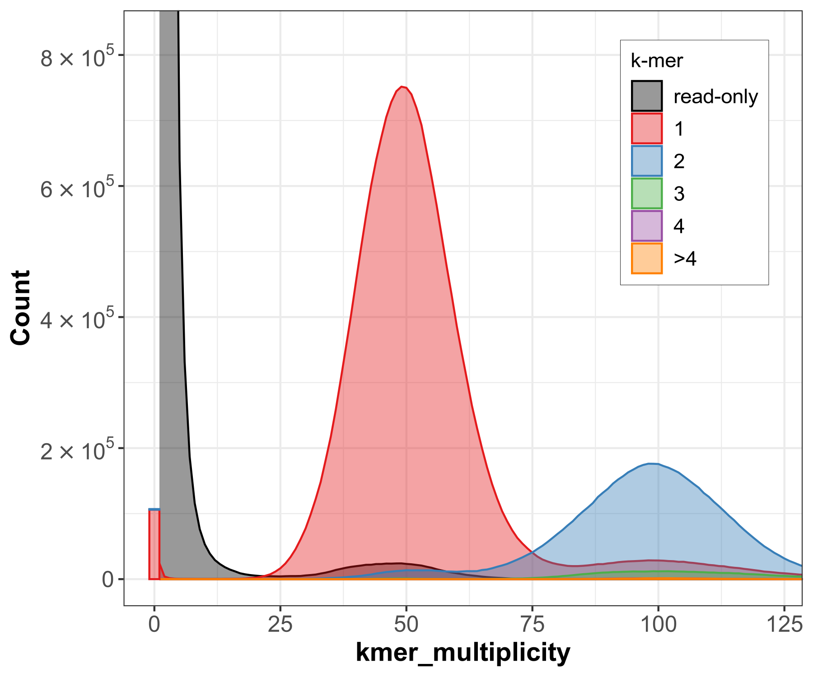

# Assembly evaluation

## Assembly statistics

[gfastats](https://github.com/vgl-hub/gfastats)

```
Formenti, G., Abueg, L., Brajuka, A., Brajuka, N., Gallardo-Alba, C., Giani, A., ... & Jarvis, E. D. (2022). Gfastats: conversion, evaluation and manipulation of genome sequences using assembly graphs. Bioinformatics, 38(17), 4214-4216.
```


```sh
gfastats assembly.fasta --nstar-report --locale en_US.UTF-8  --tabular 
```

```
# scaffolds 	30
Total scaffold length 	35,951,546
Average scaffold length 	1,198,384.87
Scaffold N50 	2,231,814
Scaffold auN 	2,740,535.61
Scaffold L50 	5
Largest scaffold 	5,107,803
Smallest scaffold 	14,284
# contigs 	30
Total contig length 	35,951,546
Average contig length 	1,198,384.87
Contig N50 	2,231,814
Contig auN 	2,740,535.61
Contig L50 	5
Largest contig 	5,107,803
Smallest contig 	14,284
# gaps in scaffolds 	0
Total gap length in scaffolds 	0
Average gap length in scaffolds 	0.00
Gap N50 in scaffolds 	0
Gap auN in scaffolds 	0.00
Gap L50 in scaffolds 	0
Largest gap in scaffolds 	0
Smallest gap in scaffolds 	0
Base composition (A:C:G:T) 	10,461,756:7,517,000:7,508,597:10,464,193
GC content % 	41.79
# soft-masked bases 	0
# segments 	30
Total segment length 	35,951,546
Average segment length 	1,198,384.87
# gaps 	0
# paths 	30
Scaffold N10 	5,107,803
Scaffold N20 	5,002,107
Scaffold N30 	3,237,547
Scaffold N40 	3,146,633
Scaffold N50 	2,231,814
Scaffold N60 	1,900,052
Scaffold N70 	1,468,560
Scaffold N80 	1,276,147
Scaffold N90 	839,386
Scaffold N100 	14,284
Scaffold L10 	1
Scaffold L20 	2
Scaffold L30 	3
Scaffold L40 	4
Scaffold L50 	5
Scaffold L60 	7
Scaffold L70 	9
Scaffold L80 	12
Scaffold L90 	15
Scaffold L100 	30
Contig N10 	5,107,803
Contig N20 	5,002,107
Contig N30 	3,237,547
Contig N40 	3,146,633
Contig N50 	2,231,814
Contig N60 	1,900,052
Contig N70 	1,468,560
Contig N80 	1,276,147
Contig N90 	839,386
Contig N100 	14,284
Contig L10 	1
Contig L20 	2
Contig L30 	3
Contig L40 	4
Contig L50 	5
Contig L60 	7
Contig L70 	9
Contig L80 	12
Contig L90 	15
Contig L100 	30
Gap N10 	0
Gap N20 	0
Gap N30 	0
Gap N40 	0
Gap N50 	0
Gap N60 	0
Gap N70 	0
Gap N80 	0
Gap N90 	0
Gap N100 	0
Gap L10 	0
Gap L20 	0
Gap L30 	0
Gap L40 	0
Gap L50 	0
Gap L60 	0
Gap L70 	0
Gap L80 	0
Gap L90 	0
Gap L100 	0 
```

Here there are 30 scaffolds, with a total assembly size of 35,951,546 bases, matching the expected size for the two haplotypes of chromosome E. The scaffold/contig N50 is 2,231,814 bases (2.2 Mb). The N50 is the same for the scaffolds and the contigs, as these are all contigs (they do not have any gaps). A gapless scaffold is basically a contig. 

## Ortholog completeness

To learn more [about BUSCO](https://www.youtube.com/watch?v=Q0T4DLGFSNQ&t=3s)

[BUSCO](https://busco.ezlab.org/)

```
Manni, M., Berkeley, M. R., Seppey, M., Simão, F. A., & Zdobnov, E. M. (2021). BUSCO update: novel and streamlined workflows along with broader and deeper phylogenetic coverage for scoring of eukaryotic, prokaryotic, and viral genomes. Molecular biology and evolution, 38(10), 4647-4654.
```

### Automatic lineage

A specific lineage can be selected for BUSCO, but if you are unsure which one would be the most appropriate, you can ask BUSCO to select the lineage it finds most suitable with the parameter `--auto-lineage`.


```sh
busco --in assembly.fasta --mode genome --out busco_out --evalue 0.001 --limit 3 --contig_break 10 --auto-lineage
```

There are several outputs, including a full table of orthologs, and a short summary with statistics.

```
# BUSCO version is: 5.5.0 
# The lineage dataset is: eukaryota_odb10 (Creation date: 2024-01-08, number of genomes: 70, number of BUSCOs: 255)
# Summarized benchmarking in BUSCO notation for file /data/dnb11/galaxy_db/files/7/9/3/dataset_793fa9a7-b2df-454f-b384-d42a90a1d21c.dat
# BUSCO was run in mode: euk_genome_met
# Gene predictor used: metaeuk

	***** Results: *****

	C:10.2%[S:1.2%,D:9.0%],F:0.8%,M:89.0%,n:255	   
	26	Complete BUSCOs (C)			   
	3	Complete and single-copy BUSCOs (S)	   
	23	Complete and duplicated BUSCOs (D)	   
	2	Fragmented BUSCOs (F)			   
	227	Missing BUSCOs (M)			   
	255	Total BUSCO groups searched		   

Assembly Statistics:
	30	Number of scaffolds
	30	Number of contigs
	35951546	Total length
	0.000%	Percent gaps
	2 MB	Scaffold N50
	2 MB	Contigs N50


Dependencies and versions:
	hmmsearch: 3.1
	bbtools: 39.01
	prodigal: 2.6.3
	busco: 5.5.0
	metaeuk: 6.a5d39d9
```

The Eukaryota lineage was selected automatically. Among 255 orthologs, 26 were found as complete in the assembly, 3 in single copy, and 23 duplicated. The high proportion of duplicated orthologs is expected, as we have a phased assembly where both copies of the chromosome, thus both alleles of the genes, are included in the assembly. Therefore the orthologs are expected in two copies. The BUSCO score here is low for two reasons: the lineage is rather large (Eukaryota) and we are only assembling one chromosome (in two copies), not the whole genome. In this case, the Eukaryota lineage is not ideal (Metazoa or Nematoda would be closer). But as this single-chromosome assembly is missing many orthologs (because it is only one chromosome), it was difficult for BUSCO to find an optimal lineage.
It should be noted that BUSCO also gives metrics on assembly size and N50, and these match the ones of gfastats.

### Metazoa lineage

We can select a specific lineage; in this case, we will test with the lineage Metazoa.



```
# BUSCO version is: 5.5.0 
# The lineage dataset is: metazoa_odb10 (Creation date: 2024-01-08, number of genomes: 65, number of BUSCOs: 954)
# Summarized benchmarking in BUSCO notation for file /data/dnb11/galaxy_db/files/7/9/3/dataset_793fa9a7-b2df-454f-b384-d42a90a1d21c.dat
# BUSCO was run in mode: euk_genome_met
# Gene predictor used: metaeuk

	***** Results: *****

	C:7.8%[S:0.5%,D:7.3%],F:0.9%,M:91.3%,n:954	   
	75	Complete BUSCOs (C)			   
	5	Complete and single-copy BUSCOs (S)	   
	70	Complete and duplicated BUSCOs (D)	   
	9	Fragmented BUSCOs (F)			   
	870	Missing BUSCOs (M)			   
	954	Total BUSCO groups searched		   

Assembly Statistics:
	30	Number of scaffolds
	30	Number of contigs
	35951546	Total length
	0.000%	Percent gaps
	2 MB	Scaffold N50
	2 MB	Contigs N50

Dependencies and versions:
	hmmsearch: 3.1
	bbtools: 39.01
	metaeuk: 6.a5d39d9
	busco: 5.5.0
```

Out of 954 orthologs in the Metazoa lineage, BUSCO found 75 complete BUSCOs, 5 as single copy, 70 duplicated. Again, most orthologs are duplicated (not single copy) because they are expected in two copies for a phased assembly of a diploid species.

## *k*-mer completeness

To learn more [about Merqury](https://www.youtube.com/watch?v=F2wsXEnMP0U)

```
Rhie, A., Walenz, B. P., Koren, S., & Phillippy, A. M. (2020). Merqury: reference-free quality, completeness, and phasing assessment for genome assemblies. Genome biology, 21(1), 245.
```

[Meryl](https://github.com/marbl/meryl)
[Merqury](https://github.com/marbl/merqury)




Merqury produces multiple plots with a layout inspired by the *k*-mer tool [KAT](https://github.com/TGAC/KAT). KAT only offered a stacked plot, whereas Merqury also as a non-stacked plot that can be more convenient to check the proper representation of *k*-mers in the assembly.




At low coverage, the *k*-mers are mostly represented as 0X (black, not included) in the assembly, which is what we would expect as they would be mostly some erroneous *k*-mers (lots of different ones, but very low coverage). The first peak for heteoryzgous *k*-mers is mostly in 1X (red), as each allele is included exactly once. There are missing *k*-mers in 0X (black), which means that there are alleles missing, and also some *k*-mers in 2X (blue), thus these are artefactual duplications. In the second peak for homozygous *k*-mers (twice the coverage of the homozygous peak), most are in 2X (blue), which is expected as homozygous regions are represented in the two hqplotypes. There are though some *k*-mers as 1X (red), meaning that they are not represented for both haplotypes. This is an issue as these 1-copy homozygous regions cannot be connected to each of the two alleles of heterozygous regions. There are also artefactual duplications with 3X, 4X and > 4X *k*-mers in this second peak, that is supposed to be only 2X.
