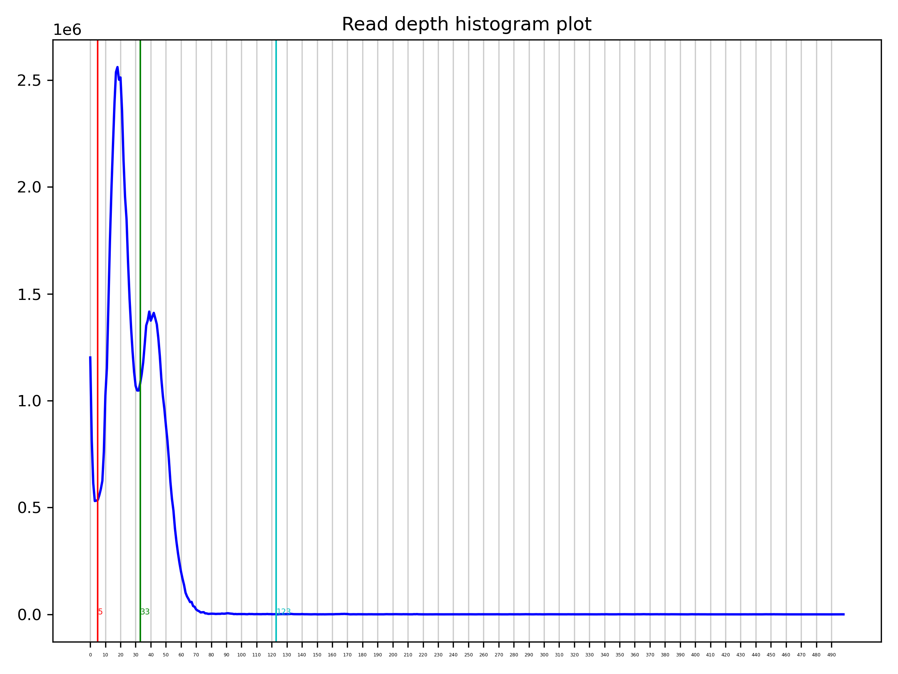

# Haplotig purging

For this part, we will use a draft assembly and reads for the nematode *Propanagrolaimus* sp. JU765 [PRJEB87118](https://www.ebi.ac.uk/ena/browser/view/PRJEB87118). These reads were generated from multiple indivduals, and the species is hermaphroditic, thus we cannot phase this assembly and will aim for a collapsed assembly, where every sequence is represented exactly once. The Nanopore R10.4 reads were sequenced on a MinION, with an LSK114 library, at the Universität zu Köln. The PacBio HiFi reads were sequenced from an ultra-low input library on a Sequel, at the [Genomics and Transcriptomics Lab](https://www.gtl.hhu.de/). 

In the following tutorial, collapsed sequences designate regions that are represented with only one copy, and uncollapsed sequences designate regions that are in multiple copies (two haplotypes most often). 

The tool purge_dups combines sequence coverage and sequence similarity to identify artefactual duplications. Uncollapsed haplotypes are expected to have lower coverage than collapsed regions (half the coverage of collapsed regions for a diploid), as the reads map to each haplotype. Then alternative haplotypes for one region are identified based on their sequence similarity.

## Mapping reads to the assembly

First, the long-read dataset needs to be mapped against the assembly to analyze the coverage of the contigs. Uncollapsed regions will usually have lower coverage than collapsed regions because the reads are mapped to each haplotype.

### PacBio HiFi reads

[minimap2](https://github.com/lh3/minimap2)

```
Li, H. (2018). Minimap2: pairwise alignment for nucleotide sequences. Bioinformatics, 34(18), 3094-3100.
```

The parameter `-x map-hifi` is used for PacBio HiFi reads. It is important to set the output format as PAF. 


```sh
minimap2 -x map-hifi --q-occ-frac 0.01 assembly.fasta hifi.fastq.gz > minimap2_hifi.paf
```

### Nanopore reads

[minimap2](https://github.com/lh3/minimap2)

The parameter `-x map-ont` is used for Nanopore R10.4 reads. With recent versions of minimap2, there is also another parameter `-x lr:hq` for Nanopore Q20+ reads. It is important to set the output format as PAF. 


```sh
minimap2 -x map-ont --q-occ-frac 0.01 assembly.fasta hifi.fastq.gz > minimap2_ont.paf
```

## Splitting and self-mapping the assembly

[purge_dups](https://github.com/dfguan/purge_dups)

```
Guan, D., McCarthy, S. A., Wood, J., Howe, K., Wang, Y., & Durbin, R. (2020). Identifying and removing haplotypic duplication in primary genome assemblies. Bioinformatics, 36(9), 2896-2898.
```

The assembly is split with `split_fa` in case there are gaps. If you are using contigs (no gaps), you can keep this step.


```sh
split_fa assembly.fasta > split.fa
```

[minimap2](https://github.com/lh3/minimap2)

The assembly is mapped against itself to find similar sequences (potential alternative haplotypes).


```sh
minimap2 -x asm5 --q-occ-frac 0.01 split.fa split.fa > minimap2_self.paf
```

## Calculating cutoffs

[purge_dups](https://github.com/dfguan/purge_dups)

Using the read mapping output from minimap2, the sequence coverage is computed by `pbcstat`, and `calcuts` then searches for adequate cutoffs, low, mid, and high. The mid cutoff is to delimitate the coverage of the uncollapsed haplotypes from the collapsed haplotypes.


```sh
gzip minimap2_hifi.paf
pbcstat -M 500 -f 0.0 -l 0 -p minimap2_hifi.paf.gz
calcuts -f 0.1 -d 0 PB.stat > cutoffs.tsv 2>calcuts.log 
python purge_dups/hist_plot.py --cutoffs cutoffs.tsv --title 'Read depth histogram plot' PB.stat hist.png
```

It is recommended to check the cutoffs selected by purge_dups to make sure that they are correct, by looking at the coverage histogram (generated by the tool with the script `hist_plot.py`). The lines delimitate the thresholds: low (red), mid (green), high (light blue). There are two peaks in the graph, the first one for uncollapsed haplotypes, and the second one for the collapsed haplotypes, with the mid threshold being selected at the transition between these two peaks. 



You can select your own cutoffs with the parameters `-l` (low), `-m` (mid), `-u` (high) in `calcuts`. If you are unsure how to select the cutoffs for your specific assembly, you can check out the [issues of purge_dups](https://github.com/dfguan/purge_dups/issues), there are tons of examples.

## Purging duplications

[purge_dups](https://github.com/dfguan/purge_dups)

Combining the sequence coverage and the sequence similarities, purge_dups classifies the fragments to identify the uncollapsed haplotypes.


```sh
gzip -c minimap2_self.paf
purge_dups -c PB.base.cov -T cutoffs.tsv -f 0.8 -a 70 -b 200 -m 500 -M 20000 -l 10000 -E 15000 minimap2_self.paf.gz > dups.bed 2> purge_dups.log
```

## Getting the purged assembly sequence

[purge_dups](https://github.com/dfguan/purge_dups)

Finally, the module `get_seqs` outputs the collapsed sequences in a FASTA file based on the classification made in the previous step.


```sh
get_seqs -e -l 10000 -m 0.05 -g 10000 dups.bed assembly.fasta
```

The purged assembly should now be checked for size, contiguity, BUSCO completeness and *k*-mer completeness. It is expected that the assembly size and the duplicated features would decrease, but the overall completeness of the assembly should not. 

# Quality control metrics for the purged contigs

## Merqury
Spectra-CN plot (fl) for the purged primary assembly 

**NOTE:** the default Merqury plot rendering is zoomed in, to zoom out you need to download the histogram file and run the [plot_spectra.R](https://github.com/marbl/merqury/blob/master/plot/plot_spectra_cn.R) script.

## BUSCO
Metazoa BUSCO set:

Nematoda BUSCO set:

